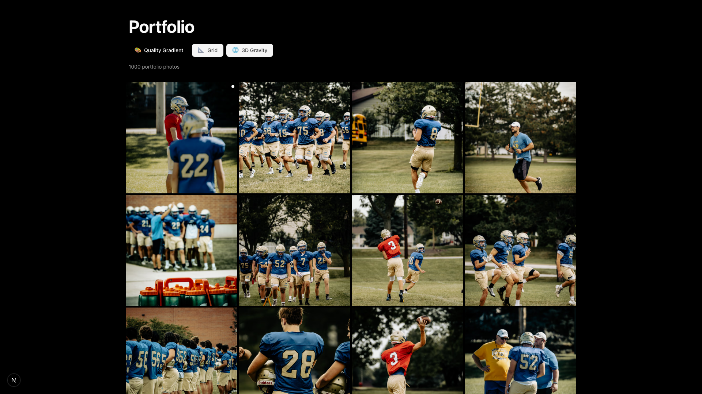
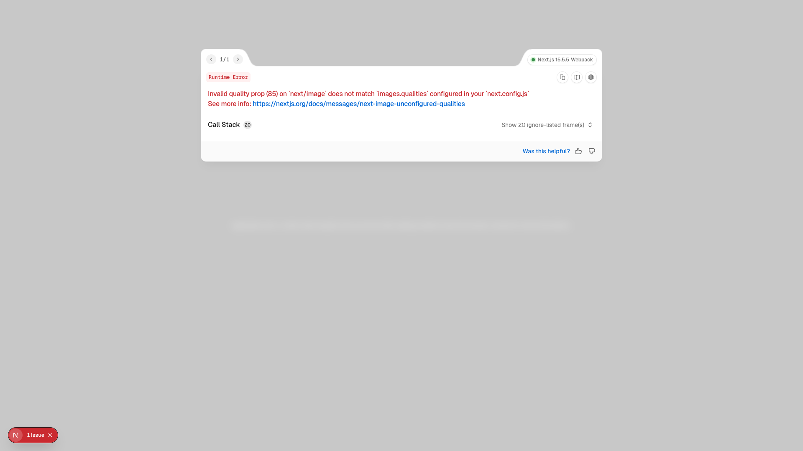
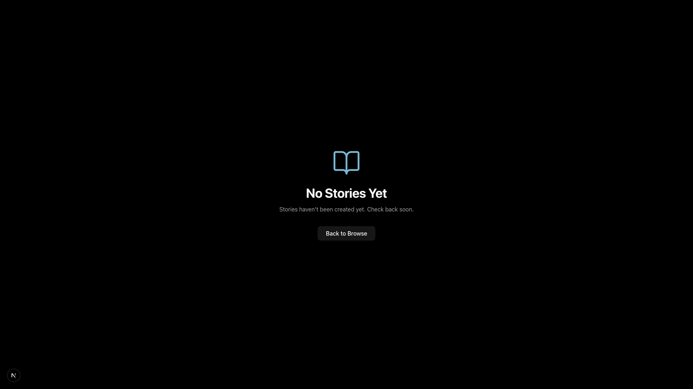
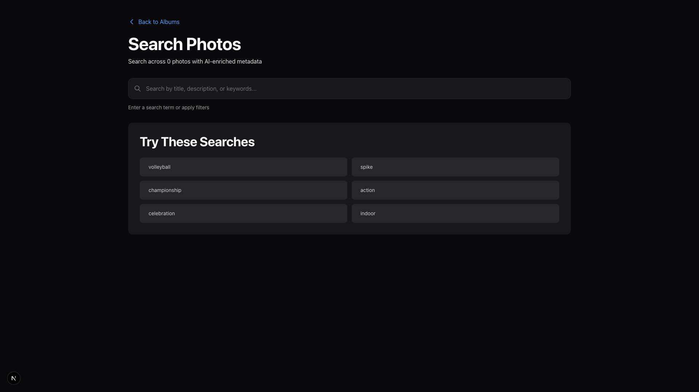

# UI/UX Audit Screenshot Report

**Generated:** 2025-10-16T03:13:24.948Z
**Total Screenshots:** 9
**Viewport Sizes:**
- Desktop: 1920x1080
- Mobile: 375x812 (iPhone 13 Pro)
- Tablet: 768x1024 (iPad)

## Screenshots

### 1. audit-homepage-initial

- **URL:** http://localhost:3000
- **Description:** Homepage initial load state
- **File:** `audit-homepage-initial.png`

**Observations:**
- ⚠️ No <main> landmark found

---

### 2. audit-portfolio-default

- **URL:** http://localhost:3000/portfolio
- **Description:** Portfolio grid default view
- **File:** `audit-portfolio-default.png`

---

### 3. audit-portfolio-filters-expanded

- **URL:** http://localhost:3000/portfolio
- **Description:** Portfolio grid with filters panel expanded
- **File:** `audit-portfolio-filters-expanded.png`

---

### 4. audit-portfolio-hover-state

- **URL:** http://localhost:3000/portfolio
- **Description:** Portfolio grid item hover state
- **File:** `audit-portfolio-hover-state.png`

---

### 5. audit-browse-grid

- **URL:** http://localhost:3000/browse
- **Description:** Browse page grid layout
- **File:** `audit-browse-grid.png`

**Observations:**
- ⚠️ No <main> landmark found
- ⚠️ No H1 heading found

---

### 6. audit-browse-filters-active

- **URL:** http://localhost:3000/browse
- **Description:** Browse page with filter interactions
- **File:** `audit-browse-filters-active.png`

**Observations:**
- ⚠️ No <main> landmark found
- ⚠️ No H1 heading found

---

### 7. audit-story-viewer-interface

- **URL:** http://localhost:3000/stories/1
- **Description:** Story viewer interface (fallback ID)
- **File:** `audit-story-viewer-interface.png`

**Observations:**
- ⚠️ No <main> landmark found
- ⚠️ No H1 heading found

---

### 8. audit-search-interface

- **URL:** http://localhost:3000/search
- **Description:** Search interface default state
- **File:** `audit-search-interface.png`

---

### 9. audit-search-results

- **URL:** http://localhost:3000/search
- **Description:** Search results view
- **File:** `audit-search-results.png`

---

## Initial Visual Audit Checklist

### Visual Consistency

- [ ] Typography hierarchy consistent across pages
- [ ] Color palette consistent
- [ ] Spacing/padding consistent
- [ ] Component styling consistent
- [ ] Animation timing consistent

### Polish Level

- [ ] Loading states present
- [ ] Empty states present
- [ ] Error states present
- [ ] Hover/focus states polished
- [ ] Micro-interactions present
- [ ] Smooth transitions

### UX Friction Points

- [ ] Navigation clarity
- [ ] Call-to-action visibility
- [ ] Filter discoverability
- [ ] Search functionality clarity
- [ ] Mobile usability
- [ ] Information hierarchy

### Accessibility

- [ ] Semantic HTML structure
- [ ] ARIA labels present
- [ ] Keyboard navigation
- [ ] Focus indicators
- [ ] Alt text on images
- [ ] Color contrast compliance

### Performance Indicators

- [ ] Image optimization visible
- [ ] Lazy loading implemented
- [ ] Skeleton loaders present
- [ ] Virtual scrolling for large lists
- [ ] No visible layout shifts

## Key Innovation Opportunities

### Microinteractions
- [ ] Button hover states
- [ ] Card hover effects
- [ ] Loading animations
- [ ] Success/error feedback
- [ ] Gesture-based interactions

### Visual Delight
- [ ] Subtle animations
- [ ] Progressive disclosure
- [ ] Contextual feedback
- [ ] Personality in UI
- [ ] Surprise & delight moments

### Information Architecture
- [ ] Clear navigation hierarchy
- [ ] Content grouping
- [ ] Visual flow
- [ ] Wayfinding elements
- [ ] Breadcrumbs/context

